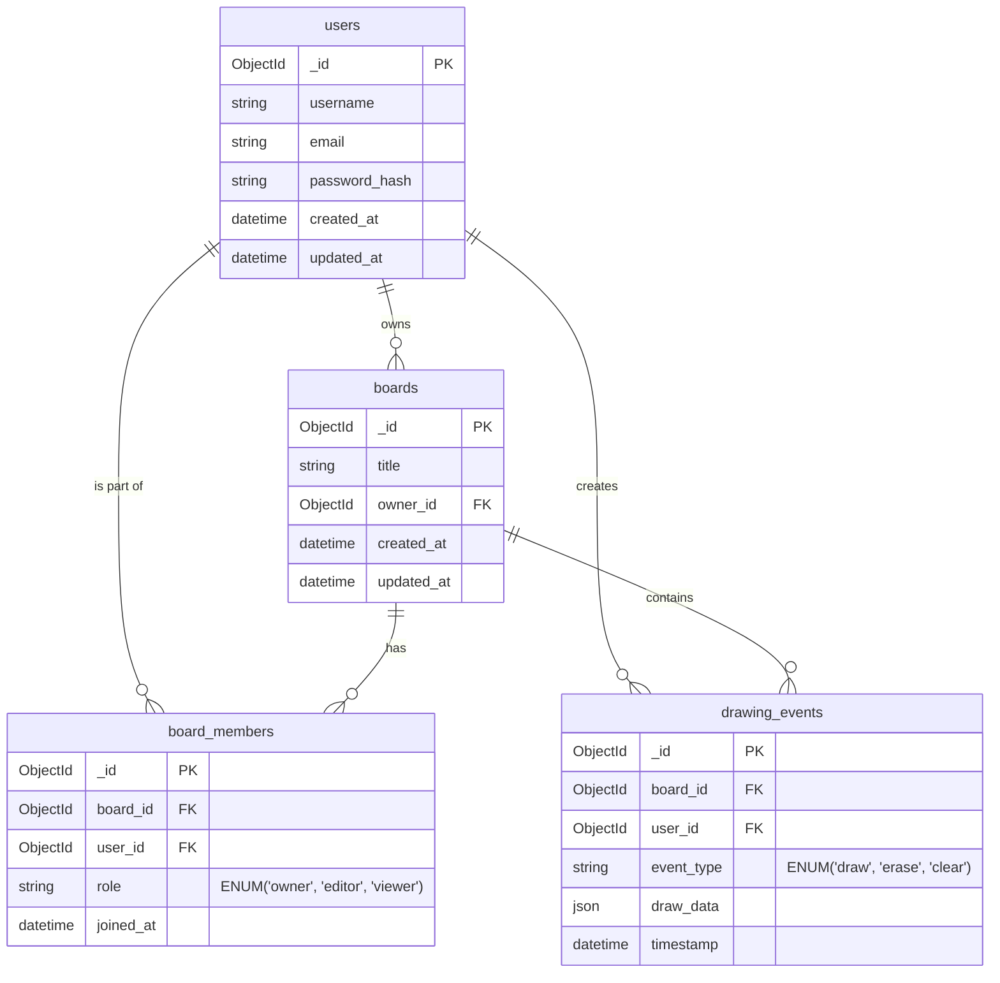

# ER Diagram – SyncSketch

## Overview
The Entity-Relationship (ER) diagram visualizes the structural schema and relationships inherent to the SyncSketch NoSQL database architecture. Built heavily targeting MongoDB configurations, it showcases a normalized core bridging to strongly-nested Event structures to facilitate fast document retrieval while heavily indexing relational constraints to ensure structural integrity across users, boards, permissions, and session timelines.

## ER Diagram

## Table Summary & Key Indexes

| Table Name | Purpose | Key Fields | Relationships / Keys | Key Indexes |
|---|---|---|---|---|
| **users** | Centralized vault managing secure authentication bounding profiles. | `username`, `email`, `password_hash` | PK: `_id` 1:M with boards, board_members, events | Unique Index on `email` to guarantee distinct accounts. |
| **boards** | Represents the overarching digital workspace isolating targeted spaces. | `title`, `created_at`, `updated_at` | PK: `_id` FK: `owner_id` (refs users) 1:M downwards | Compound Index on `owner_id` & `created_at`. |
| **board_members** | Normalized Junction seamlessly managing explicit localized RBAC matrix limits. | `role` (ENUM: owner, editor, viewer) | PK: `_id` FK: `board_id`, `user_id` | Compound Unique Index on `board_id` + `user_id`. |
| **drawing_events** | Append-only ledger building complete BSON histories enabling deterministic render limits. | `event_type`, `draw_data` (JSON) | PK: `_id` FK: `board_id`, `user_id` | Compound Performance Index mapped precisely on `board_id` + `timestamp`. |

## Database Design Strategy
SyncSketch applies a hybrid approach mapping RDBMS-like constrained normalizations across primary meta-documents (`users`, `boards`) while leveraging MongoDB’s flexible BSON document advantages for vast, append-only logs (`drawing_events`). Mapping data optimally ensures rendering an active canvas calculates in mere milliseconds while retaining extensive role authorization capabilities.

## Database Core Definitions

### Primary Keys & Foreign Keys Explanation
Each structured collection mandates a strictly generated `.ObjectId` generated cryptographically natively by MongoDB instances bridging `_id` markers to guarantee guaranteed 12-byte alphanumeric singularity preventing collision anomalies. Constraints like `owner_id`, `board_id`, and `user_id` hold strictly nested `ObjectId` references mapped logically. Mongoose `populate()` hooks utilize these mapped markers efficiently to aggregate virtualized nested BSON documents.

### Indexing Strategy
To endure heavy I/O operations from rapid simultaneous concurrent socket broadcasting, compound indexing algorithms prioritize sorting on `board_id` + `timestamp` configurations allowing instantaneous ascending retrieval mechanisms. 

### JSON Drawing Data Field Explanation
The `draw_data` field adopts an abstract `JSON` / Object signature allowing the backend system to remain relatively schema-agnostic to complex front-end specific drawing structures (bounding boxes, bezier curve coordinates, base64 asset renderings).

### Relationship Mapping
Normalizing the `board_members` essentially unwraps the complex Many-To-Many relationship between `users` accessing multiple `boards` without mutating primary core object configurations. Multiple `drawing_events` linearly aggregate recursively upwards demonstrating strong One-to-Many Board dependency mappings.

### Data Integrity Considerations
Backend Domain validations natively intercept invalid Foreign Key constraints prior to database mutation preventing ghost events mapped strictly toward detached boards bypassing potential unhandled cascading failure anomalies.

### Scalability Considerations for MongoDB
The append-only heavy `drawing_events` infrastructure perfectly mirrors architectural sharding paradigms allowing eventual horizontal partitioning distributions optimizing massive payload read/write clusters avoiding latency degradation.
