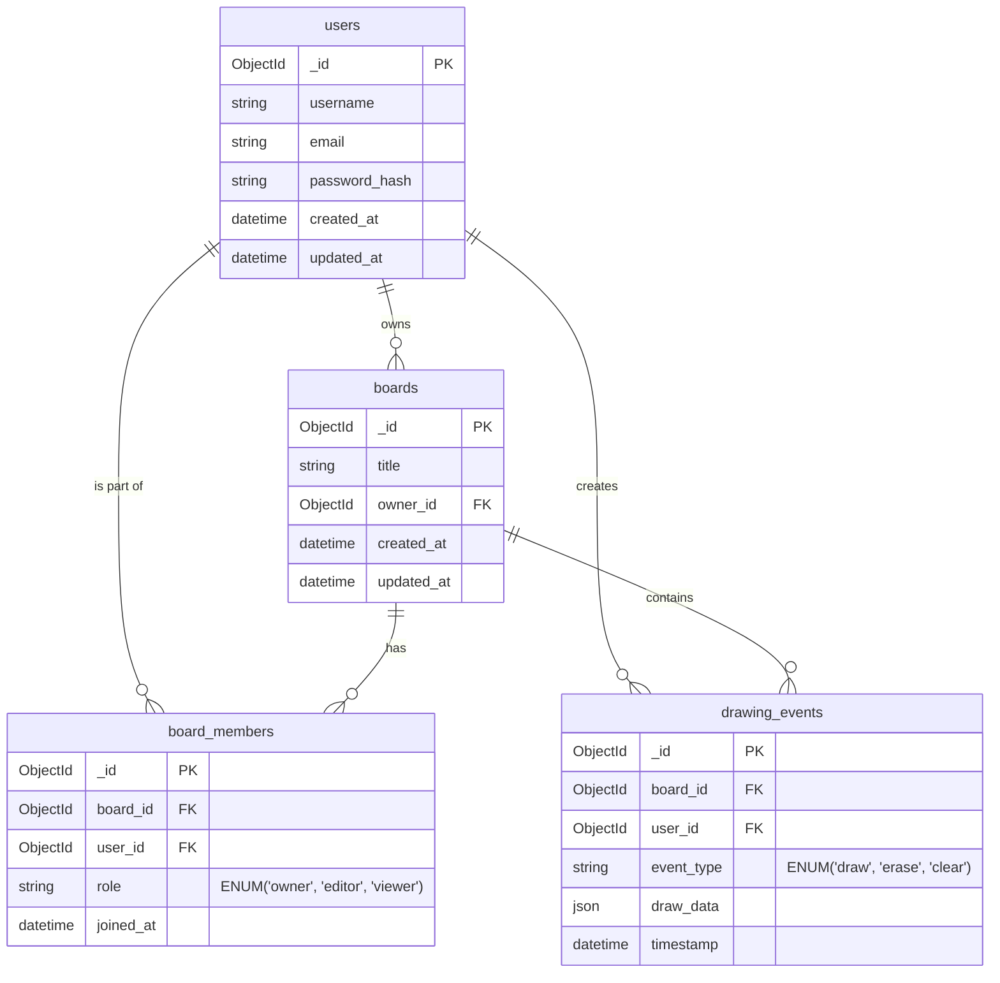

# ErDiagram.md

```mermaid
erDiagram
    users {
        ObjectId _id PK
        string username
        string email
        string password_hash
        datetime created_at
        datetime updated_at
    }

    boards {
        ObjectId _id PK
        string title
        ObjectId owner_id FK
        datetime created_at
        datetime updated_at
    }

    board_members {
        ObjectId _id PK
        ObjectId board_id FK
        ObjectId user_id FK
        string role "ENUM('owner', 'editor', 'viewer')"
        datetime joined_at
    }

    drawing_events {
        ObjectId _id PK
        ObjectId board_id FK
        ObjectId user_id FK
        string event_type "ENUM('draw', 'erase', 'clear')"
        json draw_data
        datetime timestamp
    }

    users ||--o{ boards : "owns"
    users ||--o{ board_members : "is part of"
    users ||--o{ drawing_events : "creates"
    
    boards ||--o{ board_members : "has"
    boards ||--o{ drawing_events : "contains"
```
