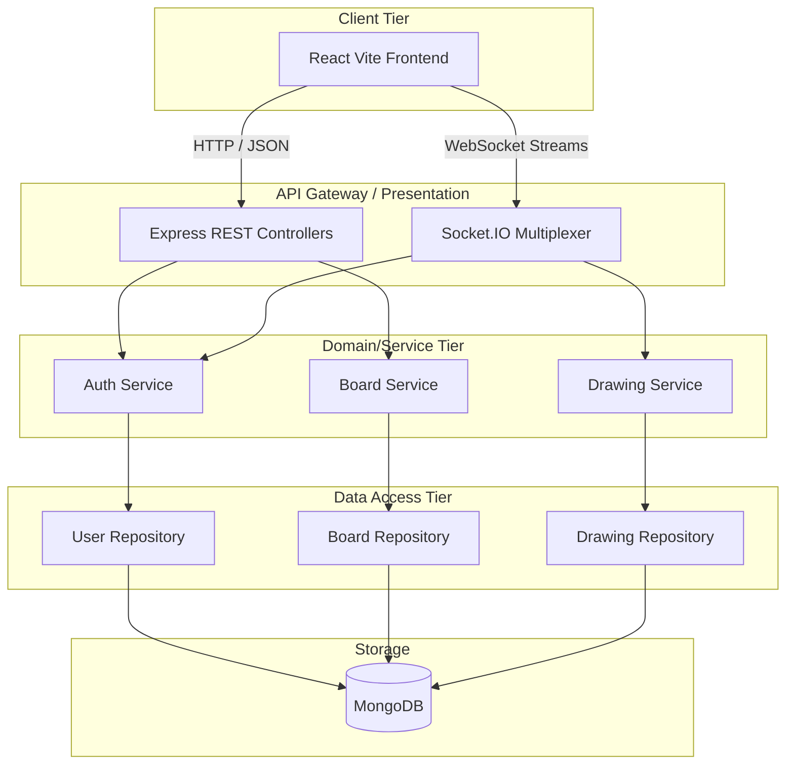

# SyncSketch – Real-Time Collaborative Whiteboard Platform
> A High-Performance, Concurrent Collaborative Workspace Engine

## Project Overview
SyncSketch is a Full Stack Real-Time Collaborative Whiteboard Platform designed to allow multiple users to interact, brainstorm, and draw simultaneously on a shared digital canvas. Engineered with a rigorous focus on **Backend Architecture**, this project models enterprise-level concurrency, leveraging REST APIs for resource management and WebSocket connections for low-latency state synchronization.

## High-Level Architecture

The backend serves as an authoritative source of truth, structured meticulously with Object-Oriented Programming (OOP) principles and Clean Architecture paradigms.



### Architectural Highlights
- **Layered Design**: Strict separation between Presentation (Controllers), Domain Logic (Services), and Data Access (Repositories).
- **Real-Time WebSockets**: Socket.IO upgrades HTTP requests to full-duplex TCP connections, multiplexing draw events in isolated network "Rooms" with sub-millisecond latencies.
- **Design Patterns**: Utilizes Repository, Service Layer, Singleton, and Command patterns to ensure a decoupled and maintainable codebase.

## Key Features
- **Stateless Authentication**: Secure signup/login utilizing tamper-proof JSON Web Tokens (JWT) protecting both Rest APIs and WebSocket handshakes.
- **Role-Based Access Control (RBAC)**: Strict permission matrices determining if a user can edit the canvas, invite others, or merely view the live broadcast.
- **Concurrent Broadcasting**: Sub-millisecond multiplexing of coordinate streams isolated by WebSocket rooms with built-in event batching.
- **Persistent Event Ledger**: Robust MongoDB append-only structures allowing precise historical rendering, playback, and Undo/Redo mechanisms.

## Technology Stack
- **Backend Core**: Node.js, Express.js
- **Real-Time Engine**: Socket.IO
- **Database**: MongoDB (Mongoose ODM)
- **Frontend**: React (Vite-optimized), Tailwind CSS

## Extensible System Documentation
For deep-dive architectural evaluations, refer to the individual component diagrams:
- **[Architectural Ideas & Patterns](./idea.md)**
- **[Use Case & RBAC Diagram](./useCaseDiagram.md)**
- **[Sequence Diagram & Real-Time Flow](./sequenceDiagram.md)**
- **[Class Diagram & OOP Principles](./classDiagram.md)**
- **[ER Diagram & Database Schema](./ErDiagram.md)**

## Setup & Installation

**1. Clone the repository**
```bash
git clone https://github.com/[your-username]/SyncSketch.git
cd SyncSketch/backend
```

**2. Configure Environment variables (`.env`)**
```env
PORT=5000
MONGODB_URI=your_cluster_string
JWT_SECRET=your_super_secret_key
JWT_EXPIRES_IN=7d
```

**3. Install and run**
```bash
npm install
npm run dev
```