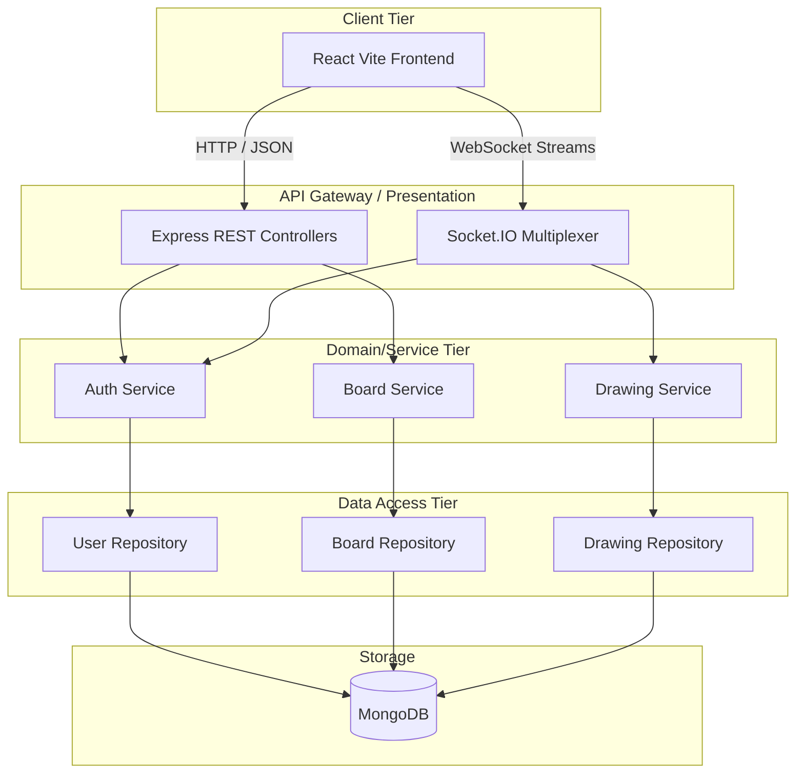

# SyncSketch – Real-Time Collaborative Whiteboard Platform
> A High-Performance, Concurrent Collaborative Workspace Engine

## Project Overview
SyncSketch is a sophisticated Full Stack Real-Time Collaborative Whiteboard Platform designed to allow multiple users to interact, brainstorm, and draw simultaneously on a shared digital canvas. Engineered as an End Semester System Design implementation with a rigorous **75% focus on Backend Architecture**, this project models enterprise-level concurrency, leveraging traditional REST APIs for resource management and WebSocket connections for low-latency state synchronization. The backend serves as an authoritative source of truth, structured meticulously with Object-Oriented Programming (OOP) principles and Clean Architecture paradigms.

## Problem Statement
Remote teams and educators often struggle to brainstorm efficiently due to a lack of immediate visual feedback tools. Existing platforms can be heavy, non-extensible, or fail to handle concurrent multi-user interactions gracefully. This system addresses these issues by providing a scalable, real-time collaboration environment with a strictly decoupled backend architecture, ensuring both high performance multiplexing and maintainable, predictable codebase scaling.

## Objectives
- **Architectural Excellence**: Deliver a scalable backend focusing on a strictly divided, clean layered hierarchy.
- **Real-Time Responsiveness**: Ensure low-latency communication capable of handling high-frequency drawing events utilizing WebSockets.
- **Maintainability**: Enforce strictly decoupled business rules guided by OOP principles and established Gang of Four design patterns.
- **Persistence & Integrity**: Persist complex, real-time drawing history securely to MongoDB to allow session continuity.

## System Architecture Overview

### Layered Architecture
The backend strictly adheres to Clean Layered Architecture to segregate responsibilities:
- **Presentation Layer (Controllers)**: Comprises Express.js Controllers handling HTTP/REST and Socket.IO Event Handlers. Strictly parses payloads and routes to Services.
- **Domain Layer (Services)**: Houses the core business algorithms, enforces RBAC logic, and coordinates complex transactions. Fully decoupled from transport mechanisms.
- **Data Access Layer (Repositories)**: Encapsulates all interactions with MongoDB via Mongoose, abstracting low-level queries from system mechanics.

### Real-Time WebSocket Architecture
Utilizing Socket.IO, the application upgrades standard HTTP requests to full-duplex TCP connections. It implements a Pub/Sub "Room" methodology where users subscribe to specific active boards, allowing the server to multiplex draw events effectively in isolated network boundaries with sub-millisecond latencies.

## High-Level Architecture Diagram



## Core Functional Features
1. **User Authentication & Authorization**: Secure signup/login utilizing stateless JWT mechanisms.
2. **Workspace Governance**: Full CRUD lifecycle operations natively mapped for distinct digital whiteboards.
3. **Role-Based Access Control (RBAC)**: Distinct permission constraints mapped to explicit roles ("Owner", "Editor", "Viewer").
4. **Real-Time Canvas Synchronization**: Concurrent broadcasting of stroke coordinates to isolated routing namespaces.
5. **Drawing Mechanics**: Support for abstracted drawing tools (Pencil, Eraser) mapping varying geometry payload calculations.
6. **State Persistence & Ledger**: Continuous, asynchronous event persistence granting playback and Undo/Redo possibilities without bottlenecking socket streams.

## Non-Functional Requirements
- **Performance**: High socket multiplex throughput with average HTTP response cycles resolved under 200ms.
- **Scalability**: Designed explicitly for horizontal scaling of the WebSocket layer via Redis Adapters.
- **Reliability**: Fault-tolerant socket reconnection loops ensuring data stream validity.
- **Security**: Robust cryptographic hashing protecting entity parameters.

## Technology Stack
- **Backend**: Node.js, Express.js
- **Real-Time Engine**: Socket.IO (WebSockets)
- **Database**: MongoDB & Mongoose ODM
- **Frontend**: React (Vite-optimized), Tailwind CSS
- **Authentication**: Stateless JSON Web Tokens (JWT) & Bcrypt

## Folder Structure
```text
src/
├── config/           # Environment variables, database connection singletons
├── controllers/      # Express route handlers parsing HTTP requests
├── middlewares/      # JWT authorization, validation, socket handshake guards
├── models/           # Mongoose ODM schemas
├── repositories/     # Database access abstraction layer (BaseRepository logic)
├── routes/           # Express router definitions
├── services/         # Core business and domain logic
├── socket/           # WebSocket event listeners and room multiplexers
├── types/            # TypeScript schemas and interface boundaries
└── utils/            # Cryptography, helper functions, formatters
```

## API Design Overview
The system implements a Level 2 RESTful maturity model utilizing explicit HTTP verbs predicting behavior.
- `POST /api/auth/register` - Create user entity
- `POST /api/auth/login` - Retrieve access token
- `POST /api/boards` - Instantiate new workspace
- `GET /api/boards/:id` - Hydrate workspace metadata and historical draw array
- `PATCH /api/boards/:id/share` - Alter RBAC matrix

## Real-Time Communication Flow
1. **Handshake**: The Socket Server intercepts connection events, extracting JWT headers to cryptographically confirm identity before routing.
2. **Subscription**: Upon successful auth validation, User connects to a dynamically generated Socket `Room` mapped to the Board ID.
3. **Broadcast & Persist**: As the user draws, `.emit('draw_stroke', payload)` sends coordinate streams. The backend asynchronously pipes this payload to the database repository and simultaneously multicasts it to all other array members occupying that specific `Room`.

## Database Design Strategy
SyncSketch applies a hybrid approach utilizing RDBMS-like constrained normalizations across primary meta-documents (`users`, `boards`) while utilizing MongoDB’s BSON document structural flexibility for append-only logs (`drawing_events`). Critical MongoDB collections feature strong compound indexes (e.g., `board_id` and `timestamp`) accelerating large payload chronological retrievals.

## Security Considerations
- **Cryptographic Hashing**: Passwords strongly hashed via Bcrypt prior to persistence.
- **Stateless Tokens**: Tamper-proof JWTs tracking sessions over both API arrays and WS upgrades.
- **Authorization Enforcement**: Endpoint validation rejecting non-Editors from transmitting socket write events.

## Scalability Considerations
- **Event Batching**: Aggregation buffering preventing rapid I/O database locks during dense user drawing interactions.
- **Stateless Nodes**: JWTs allow HTTP nodes to scale horizontally lacking memory constraints.
- **Pub/Sub Prepared**: Architecture allows inserting Redis to share WebSocket rooms laterally across separated physical server clusters.

## Design Patterns Used
- **Repository Pattern**: Centralizes MongoDB access arrays.
- **Service Layer Pattern**: Defines core bounds segregating algorithm logic from basic HTTP operations.
- **Singleton Pattern**: Ensures resource managers (`SocketManager`, Database Connection pools) don't trigger memory leaks.
- **Command Pattern**: Encapsulates drawing instructions natively permitting chronological playback and Undo methodologies.

## OOP Principles Applied
- **Encapsulation**: Private class mappings within Services hiding Data abstraction bounds.
- **Abstraction**: Base class implementations (`BaseRepository`) hiding complex BSON aggregations.
- **Inheritance**: Descendant classes inherently obtaining base DB operations bypassing boilerplate declarations.
- **Polymorphism**: The singular execution of `.draw()` contextualizing behavior dynamically whether mapping a Pencil or Eraser.

## Setup & Installation Instructions

**1. Clone the repository**
```bash
git clone https://github.com/[your-username]/SyncSketch.git
cd SyncSketch
```

**2. Install Backend Dependencies**
```bash
cd backend
npm install
```

**3. Configure Environment Variables**
Create a `.env` file in the root backend directory:
```env
PORT=5000
MONGODB_URI=your_cluster_string
JWT_SECRET=your_super_secret_key
JWT_EXPIRES_IN=7d
```

**4. Start the Application**
```bash
npm run dev
```

## Future Enhancements
- Integration of a distributed caching cluster (Redis) expediting token checks and active session metadata fetches.
- Real-time telepresence tracking illustrating concurrent user cursor movements prior to stroke execution.
- Extensible shape tooling mapping geometries like polygons and bezier curves.