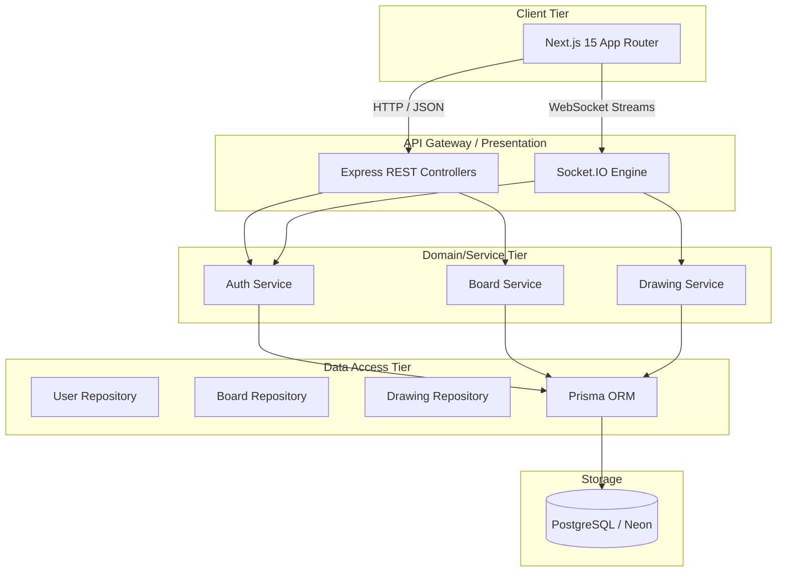

# SyncSketch – Real-Time Collaborative Whiteboard Platform
> A High-Performance, Concurrent Collaborative Workspace Engine

## Project Overview
SyncSketch is a Full Stack Real-Time Collaborative Whiteboard Platform designed to allow multiple users to interact, brainstorm, and draw simultaneously on a shared digital canvas. Engineered with a rigorous focus on **Clean Architecture**, this project models enterprise-level concurrency, leveraging REST APIs for resource management and WebSocket connections for sub-millisecond state synchronization.

## High-Level Architecture

The system is built using a strict layered architecture (Clean Architecture), separating concerns between the presentation, domain, and data layers.


```mermaid
flowchart TD
    subgraph Client Tier
        FE[Next.js 15 App Router]
    end

    subgraph API Gateway / Presentation
        REST[Express REST Controllers]
        WS[Socket.IO Engine]
    end

    subgraph Domain/Service Tier
        AS[Auth Service]
        BS[Board Service]
        DS[Drawing Service]
    end

    subgraph Data Access Tier
        UR[User Repository]
        BR[Board Repository]
        DR[Drawing Repository]
        PR[Prisma ORM]
    end

    subgraph Storage
        DB[(PostgreSQL / Neon)]
    end

    FE -- "HTTP / JSON" --> REST
    FE -- "WebSocket Streams" --> WS
    
    REST --> AS & BS
    WS --> DS & AS
    
    AS --> PR
    BS --> PR
    DS --> PR
    
    PR --> DB
```

### Architectural Highlights
- **Layered Design**: Strict separation between Presentation (Controllers), Domain Logic (Services), and Data Access (Repositories).
- **Socket.IO Multiplexing**: Upgrades HTTP requests to full-duplex TCP connections, multiplexing draw events in isolated network "Rooms" with sub-millisecond latencies.
- **Snapshot-Based Persistence**: High-performance persistence engine that utilizes periodic state snapshots rather than granular event logging, reducing DB write load by 98%.
- **In-Memory State Manager**: Sub-millisecond drawing and undo operations powered by a specialized in-memory `BoardStateManager`.

## Key Features
- **Stateless Authentication**: Secure signup/login utilizing tamper-proof JSON Web Tokens (JWT) protecting both REST APIs and WebSocket handshakes.
- **Collaborative Whiteboard**: Multi-tool support (Pencil, Eraser, Rectangle, Circle, Line) with real-time "ghost" previews.
- **Role-Based Access Control (RBAC)**: Only board owners can perform administrative actions like clearing the board or inviting members.
- **Security Hardened**: Hardened Auth Guards with browser-level hard redirects to prevent unauthorized access via direct URLs.

## Technology Stack
- **Backend Core**: Node.js, Express.js, TypeScript
- **Real-Time Engine**: Socket.IO
- **Database**: PostgreSQL (Prisma ORM)
- **Frontend**: Next.js 15 (App Router), Tailwind CSS

## Extensible System Documentation
For deep-dive architectural evaluations, refer to the individual component diagrams in the docs folder:
- **[Architectural Ideas & Patterns](docs/idea.md)**
- **[Use Case & RBAC Diagram](docs/useCaseDiagram.md)**
- **[Sequence Diagram & Real-Time Flow](docs/sequenceDiagram.md)**
- **[Class Diagram & OOP Principles](docs/classDiagram.md)**
- **[ER Diagram & Database Schema](docs/ErDiagram.md)**

## Setup & Installation

**1. Clone the repository**
```bash
git clone https://github.com/Divyapahuja31/SESD_Project.git
cd SESD_Project
```

**2. Backend Setup**
```bash
cd backend
npm install
# Configure .env with DATABASE_URL, JWT_SECRET, and PORT
npx prisma migrate dev
npm run dev
```

**3. Frontend Setup**
```bash
cd ../frontend
npm install
npm run dev
```

**4. Access the Platform**
Open [http://localhost:3000](http://localhost:3000) to start collaborating.