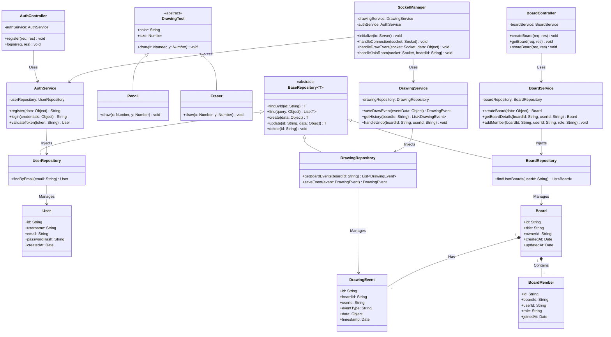

# classDiagram.md

```mermaid
classDiagram
    direction TB
    
    %% Base Classes
    class BaseRepository~T~ {
        <<abstract>>
        +findById(id: String) T
        +find(query: Object) List~T~
        +create(data: Object) T
        +update(id: String, data: Object) T
        +delete(id: String) void
    }

    class DrawingTool {
        <<abstract>>
        +color: String
        +size: Number
        +draw(x: Number, y: Number)* void
    }

    class Pencil {
        +draw(x: Number, y: Number) void
    }

    class Eraser {
        +draw(x: Number, y: Number) void
    }

    DrawingTool <|-- Pencil
    DrawingTool <|-- Eraser

    %% Repositories
    class UserRepository {
        +findByEmail(email: String) User
    }
    class BoardRepository {
        +findUserBoards(userId: String) List~Board~
    }
    class DrawingRepository {
        +getBoardEvents(boardId: String) List~DrawingEvent~
        +saveEvent(event: DrawingEvent) DrawingEvent
    }

    BaseRepository <|-- UserRepository
    BaseRepository <|-- BoardRepository
    BaseRepository <|-- DrawingRepository

    %% Entities/Models
    class User {
        +id: String
        +username: String
        +email: String
        +passwordHash: String
        +createdAt: Date
    }

    class Board {
        +id: String
        +title: String
        +ownerId: String
        +createdAt: Date
        +updatedAt: Date
    }

    class BoardMember {
        +id: String
        +boardId: String
        +userId: String
        +role: String
        +joinedAt: Date
    }

    class DrawingEvent {
        +id: String
        +boardId: String
        +userId: String
        +eventType: String
        +data: Object
        +timestamp: Date
    }

    %% Services
    class AuthService {
        -userRepository: UserRepository
        +register(data: Object) String
        +login(credentials: Object) String
        +validateToken(token: String) User
    }

    class BoardService {
        -boardRepository: BoardRepository
        +createBoard(data: Object) Board
        +getBoardDetails(boardId: String, userId: String) Board
        +addMember(boardId: String, userId: String, role: String) void
    }

    class DrawingService {
        -drawingRepository: DrawingRepository
        +saveDrawEvent(eventData: Object) DrawingEvent
        +getHistory(boardId: String) List~DrawingEvent~
        +handleUndo(boardId: String, userId: String) void
    }

    %% Controllers
    class AuthController {
        -authService: AuthService
        +register(req, res) void
        +login(req, res) void
    }

    class BoardController {
        -boardService: BoardService
        +createBoard(req, res) void
        +getBoard(req, res) void
        +shareBoard(req, res) void
    }
    
    class SocketManager {
        -drawingService: DrawingService
        -authService: AuthService
        +initialize(io: Server) void
        +handleConnection(socket: Socket) void
        +handleDrawEvent(socket: Socket, data: Object) void
        +handleJoinRoom(socket: Socket, boardId: String) void
    }

    %% Associations & Dependencies
    AuthController --> AuthService : Uses
    BoardController --> BoardService : Uses
    SocketManager --> DrawingService : Uses
    SocketManager --> AuthService : Uses
    
    AuthService --> UserRepository : Injects
    BoardService --> BoardRepository : Injects
    DrawingService --> DrawingRepository : Injects

    UserRepository --> User : Manages
    BoardRepository --> Board : Manages
    DrawingRepository --> DrawingEvent : Manages
    
    Board "1" *-- "*" BoardMember : Contains
    Board "1" *-- "*" DrawingEvent : Has
```
