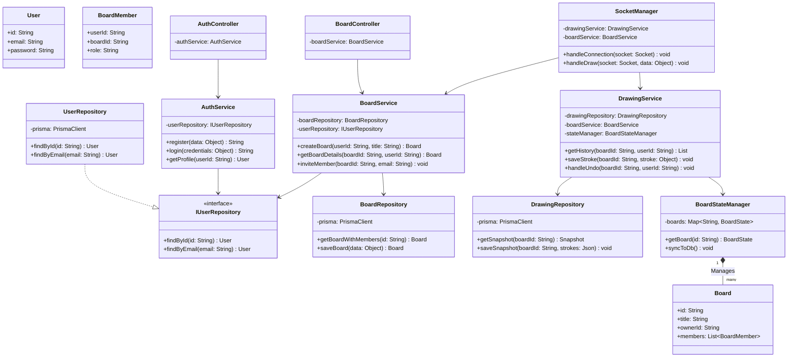

# Class Diagram – SyncSketch

## Overview
The Class Diagram delineates the static structural blueprint of the SyncSketch backend system. It rigorously applies the **Clean Layered Architecture** methodology, displaying how domain entities interact, how services process business logic, and how physical database queries are abstracted through the Repository pattern.

## Class Diagram

## Layer Responsibilities

| Layer / Component | Examples | Responsibilities |
|---|---|---|
| **Controllers** | `AuthController`, `BoardController` | Entry points for REST APIs. Parse request params, call services, and return HTTP responses. |
| **Services** | `AuthService`, `DrawingService` | Application core boundary. Handles business rules, security checks, and orchestrates repository calls. |
| **Repositories** | `UserRepository`, `DrawingRepository` | Direct interaction with **Prisma ORM**. Abscracts raw SQL/DB logic from the rest of the application. |
| **State Manager** | `BoardStateManager` | Memory-management layer. Keeps active boards in a high-speed Map for real-time performance. |

## Design Patterns in the Class Diagram

| Pattern | Component Applied | Purpose |
|---|---|---|
| **Repository Pattern** | `UserRepository`, etc. | Decouples business logic from the specific database implementation (SQL/ORM). |
| **Dependency Injection**| Services & Controllers | Repositories and Services are injected via constructors (Inversion of Control), facilitating unit testing. |
| **State Pattern** | `BoardStateManager` | Manages the lifecycle of boards in memory (Active vs. Hibernating). |
| **Facade Pattern** | `SocketManager` | Provides a unified entry point for all WebSocket-based drawing and room logic. |

## Dependency Flow
The architecture follows a strict **unidirectional dependency flow**:
`Controllers/Sockets` -> `Services` -> `Repositories` -> `Database`.

Higher-level modules (Services) depend on abstractions (`IUserRepository`) rather than concrete implementations, following the **Dependency Inversion Principle**. This ensures that the system remains modular, testable, and maintainable as it scales.
