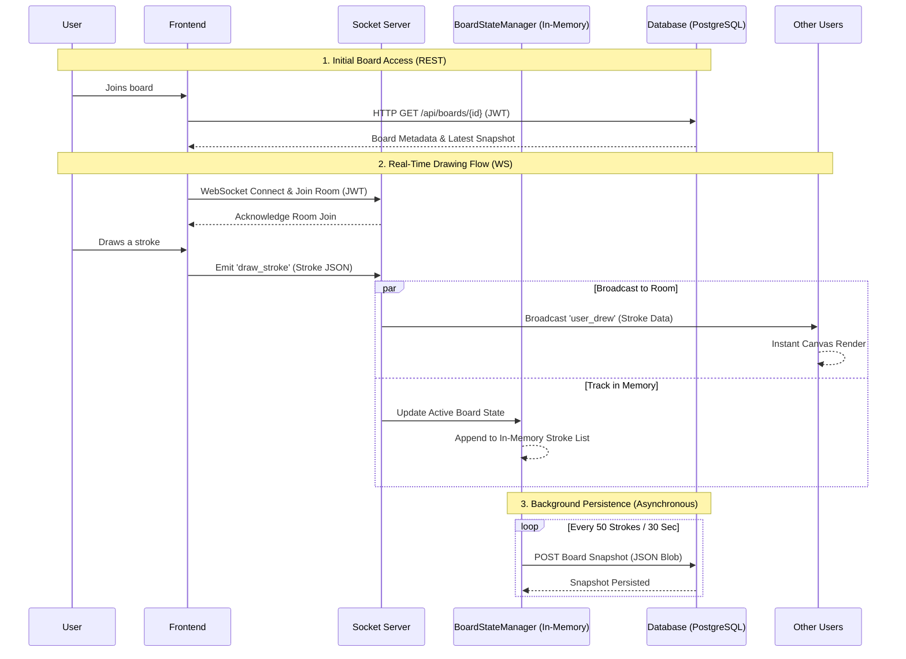

# Sequence Diagram – SyncSketch

## Overview
This Sequence Diagram models the chronological flow of messages between system actors and backend components. It highlights the **High-Performance Bridge** between real-time WebSocket communication and the **Snapshot-Based** PostgreSQL persistence model.

## Sequence Diagram

## Flow Summary

| Phase | Protocol | Action | Persistence Logic |
|---|---|---|---|
| **Initial Fetch** | HTTP (REST) | Downloads metadata and the single latest board snapshot. | Reads from PostgreSQL. |
| **Drawing Loop** | WebSocket | High-speed broadcast of coordinate payloads to room members. | Tracked in-memory (No DB write). |
| **Checkpointing** | Internal | Periodic "flashing" of the in-memory state to the database. | Writes a single JSON blob to PostgreSQL. |

## Step-by-Step Flow Explanation
1. **Initial Access**: The User opens a board. The frontend fetches the single most recent **Snapshot** from PostgreSQL. This ensures boards with thousands of strokes load instantly.
2. **WebSocket Handshake**: The frontend upgrades to a persistent connection. The user is cryptographically validated and placed in an isolated "Socket Room".
3. **The Real-Time Loop**: When a user draws, the payload is emitted. The server undergoes a **Parallel Action**:
    - **Broadcast**: It immediately sends the stroke to other users (30-50ms latency).
    - **State Tracking**: It updates the **BoardStateManager** in the server's RAM.
4. **Optimized Persistence**: Instead of writing to the database on every stroke, the server only saves to PostgreSQL when a milestone is hit (e.g., every 50 strokes) or when the board becomes inactive. This reduces database load by over 95%.

## Performance Advantages
By decoupling the **Broadcast Loop** from the **Persistence Loop**, SyncSketch ensures that database latency never causes a "stutter" in the drawing experience. The system treats PostgreSQL as a long-term checkpointing system rather than a real-time event logger.
