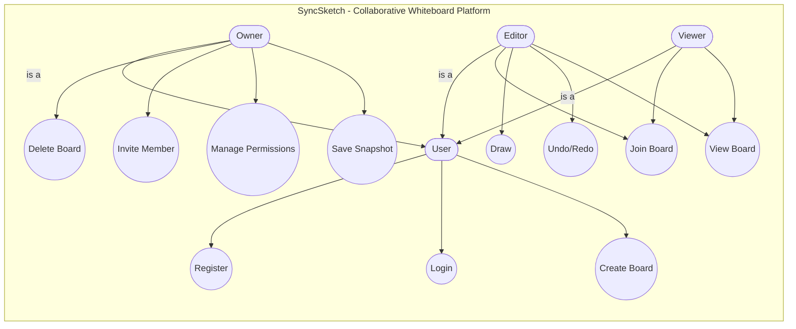

# Use Case Diagram – SyncSketch

## Overview
The Use Case Diagram for SyncSketch illustrates the high-level functional requirements of the platform. It defines how users interact with the collaborative environment based on a strict **Role-Based Access Control (RBAC)** model, ensuring that permissions are mapped precisely to user profiles.

## Use Case Diagram

## Actors Description

| Actor | Type | Description |
|---|---|---|
| **User** | Base | Any authenticated individual. Can create boards and manage their own profile. |
| **Owner** | Inherited | The creator of a specific board. Holds administrative sovereignty, including the ability to delete the board and invite others. |
| **Editor** | Inherited | An invited participant with write-access. Can contribute to the canvas and perform undo/redo actions. |
| **Viewer** | Inherited | A passive participant. Can view the live board in real-time but cannot modify the canvas. |

## Use Case Descriptions

| Use Case | Actor(s) | Description |
|---|---|---|
| **Register** | User | Create a new profile with secure credentials stored in PostgreSQL. |
| **Login** | User | Authenticate to receive a JWT for secure REST and WebSocket access. |
| **Create Board** | User | Initialize a new drawing workspace and become its primary Owner. |
| **Delete Board** | Owner | Permanently remove the board and all its associated snapshots from the database. |
| **Invite Member** | Owner | Send an invitation to another user to join the board as an Editor or Viewer. |
| **Save Snapshot** | Owner | Trigger an authoritative save of the current in-memory canvas state to PostgreSQL. |
| **Join Board** | Editor, Viewer | Authenticate into a specific WebSocket Room to receive real-time updates. |
| **Draw** | Editor | Broadcast coordinate payloads (pencil, shapes) to all room participants. |
| **Undo/Redo** | Editor | Revert or re-apply recent strokes using the in-memory board state. |
| **View Board** | Editor, Viewer | Subscribe to the real-time drawing stream with sub-millisecond latency. |

## Role-Based Access Control (RBAC)
The architecture ensures that sensitive actions (like inviting members or clearing a board) are strictly limited to the **Owner**. This is enforced through dedicated middleware on the backend and hardened Auth Guards on the frontend, ensuring that regardless of URL manipulation, only authorized users can perform state-altering actions.

## Real-Time Synchronization Logic
Unlike traditional static applications, the "Draw" and "View" use cases operate through a high-speed WebSocket pipeline. This ensures that the system boundary remains responsive even under heavy concurrent loads, as coordinate data bypasses standard HTTP overhead to reach all participants instantly.
