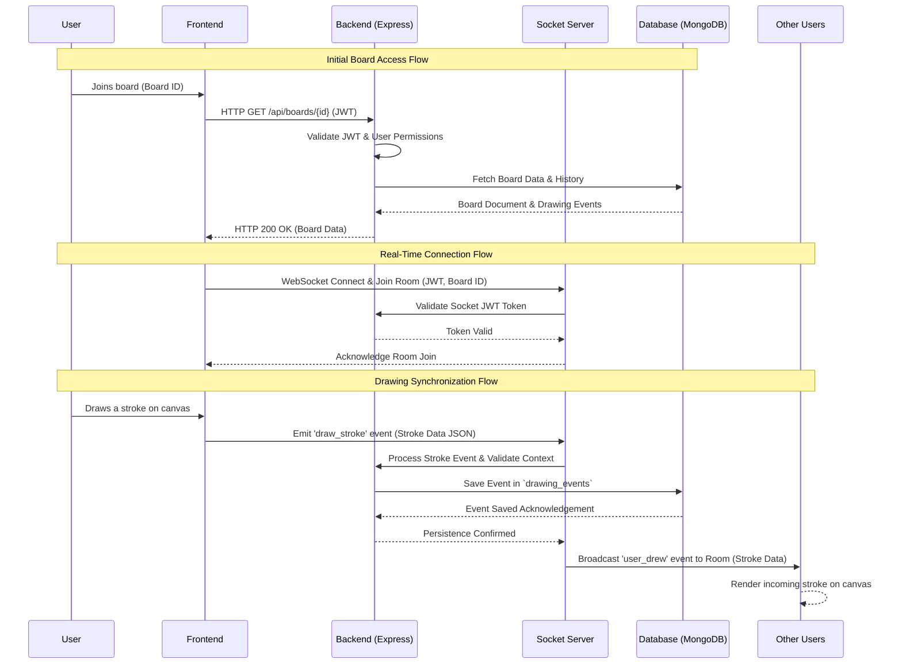

# sequenceDiagram.md

```mermaid
sequenceDiagram
    participant U as User
    participant F as Frontend
    participant B as Backend (Express)
    participant S as Socket Server
    participant DB as Database (MongoDB)
    participant O as Other Users

    Note over U, DB: Initial Board Access Flow
    U->>F: Joins board (Board ID)
    F->>B: HTTP GET /api/boards/{id} (JWT)
    B->>B: Validate JWT & User Permissions
    B->>DB: Fetch Board Data & History
    DB-->>B: Board Document & Drawing Events
    B-->>F: HTTP 200 OK (Board Data)
    
    Note over U, O: Real-Time Connection Flow
    F->>S: WebSocket Connect & Join Room (JWT, Board ID)
    S->>B: Validate Socket JWT Token
    B-->>S: Token Valid
    S-->>F: Acknowledge Room Join
    
    Note over U, O: Drawing Synchronization Flow
    U->>F: Draws a stroke on canvas
    F->>S: Emit 'draw_stroke' event (Stroke Data JSON)
    S->>B: Process Stroke Event & Validate Context
    B->>DB: Save Event in `drawing_events`
    DB-->>B: Event Saved Acknowledgement
    B-->>S: Persistence Confirmed
    S->>O: Broadcast 'user_drew' event to Room (Stroke Data)
    O-->>O: Render incoming stroke on canvas
```
