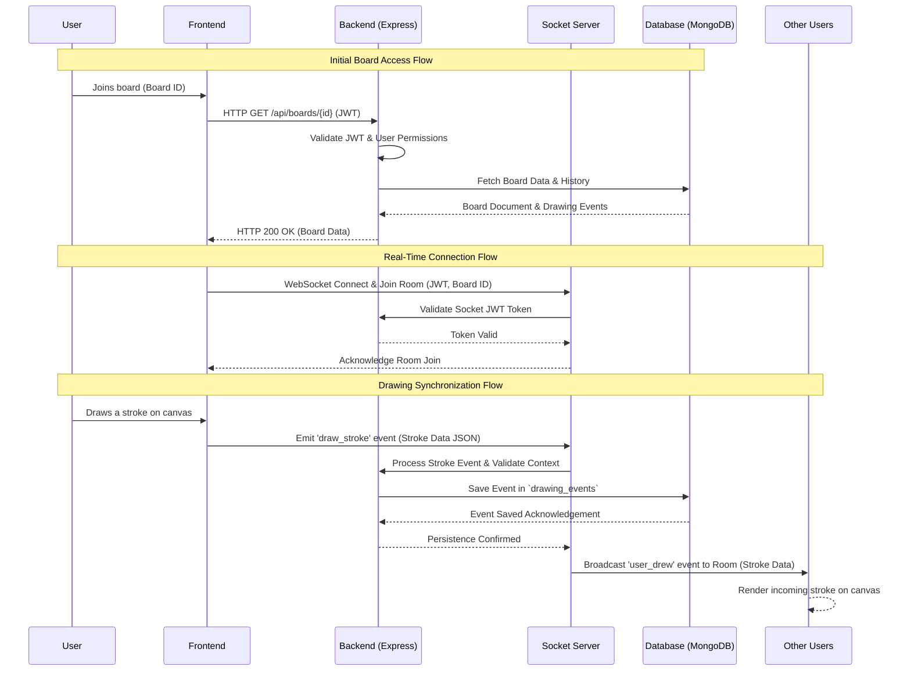

# Sequence Diagram – SyncSketch

## Overview
This Sequence Diagram models the chronological flow of messages between system actors and backend components during the two most critical operational phases: the initial asynchronous board data fetch and the real-time, bidirectional drawing synchronization. It maps the transition from standard RESTful communication to a persistent WebSocket connection.

## Sequence Diagram

## Flow Summary

| Phase | Client Action | Backend / System Action | Protocol |
|---|---|---|---|
| **Initial Access** | User requests to join specific URL. | Validates JWT; Checks user bounds; Fetches metadata & history from DB. | HTTP (REST) |
| **WebSocket Upgrade**| Frontend initiates Socket handshake. | Intercepts upgrade; Cryptographically verifies Auth Token; Subscribes Socket to a specific Room. | WebSocket |
| **Drawing Sync** | User applies strokes to canvas. | Server parses JSON payload; Triggers DB append logic asynchronously; Multiplexes stroke array to concurrent Room subscribers. | WebSocket |

## Main Scenario Description
The primary scenario details an authenticated user launching a sophisticated whiteboard session. The system must securely validate their identity, assemble the historical state of the canvas from the database, upgrade the transport protocol to WebSockets, and subsequently handle a continuous stream of drawing actions broadcasted concurrently to other connected participants.

## Step-by-Step Flow Explanation
1. **Initial Access**: The User interacts with the Frontend to open a specific board.
2. **HTTP State Fetch**: The Frontend issues an HTTP GET request to the Express API backend, attaching the encoded JWT.
3. **Validation & Retrieval**: The backend validates the JWT signature and checks the Access Control matrix to confirm the user has permissions to view the board. Upon confirmation, it fetches the Board metadata and associated drawing snapshot history from MongoDB.
4. **WebSocket Upgrade**: Having rendered the historical state, the Frontend initiates a socket connection.
5. **Real-Time Handshake**: The Socket Server intercepts the connection event, extracts the JWT attached to the handshake headers, and cryptographically confirms their identity before dropping them into an isolated socket "Room" assigned to that board.
6. **Interaction Loop**: The User executes a stroke on the canvas. The Frontend instantly streams this event payload (`draw_stroke`).
7. **Broadcast & Persistence**: The WebSocket layer parses the event, delegates the payload to the specific database service to guarantee persistent logging asynchronously, and simultaneously multiplexes this drawing event to all other clients in the exact room.
8. **Client Sync**: Other users receive the broadcast payload and invoke their local rendering engines to reflect the mutation.

## HTTP vs WebSocket Communication Explanation
SyncSketch cleverly combines both networking paradigms. **HTTP (REST)** is utilized for authoritative, state-altering configuration (Authentication, Board CRUD, Permissions) due to its standard stateless request-response model easily scaling behind balancers. **WebSockets (Socket.IO)** are employed explicitly for collaborative canvas mutations because their persistent, full-duplex TCP connections eradicate the connection overhead latency associated with continuous HTTP polling, enabling micro-millisecond concurrency.

## Data Persistence Flow
Every dispatched canvas mutation is piped into a `drawing_events` append-only collection in MongoDB. This persistence operates asynchronously ensuring the database I/O bottleneck does not artificially block the highly-sensitive socket broadcast loop. The system emits to concurrent room members immediately, trusting that Document creation on the DB will eventual-resolve via the Mongoose driver connection pool.

## Real-Time Broadcast Logic
The Socket.IO Room paradigm dictates the broadcast radius. A User's emitted payload triggers a `socket.to(boardId).emit(...)` operation. This logic ensures spatial isolation, guaranteeing drawing coordinate payloads are broadcast strictly to participants situated identically on the targeted board, bypassing the sender's own loopback to conserve bandwidth and prevent glitching locally rendered paths.

## JWT Validation Flow
JSON Web Tokens heavily secure both HTTP and WS pathways. 
- **HTTP**: An Express Middleware intercepts incoming requests, decrypts the Bearer Token using the Server Secret, and appends the decoded User payload to `req.user`.
- **WebSocket**: Socket.IO utilizes a specific Handshake Middleware. When establishing the connection, it parses the `auth.token` parameter. Connection upgrading fails instantly via TCP cancellation if the encryption signature is invalid, establishing a secure perimeter before any socket event bindings initialize.
