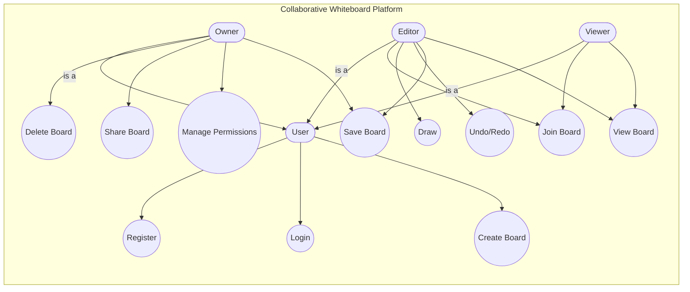

# useCaseDiagram.md

```mermaid
flowchart LR
    %% Actors
    User([User])
    Owner([Owner])
    Editor([Editor])
    Viewer([Viewer])

    %% Inheritance / Roles
    Owner -->|is a| User
    Editor -->|is a| User
    Viewer -->|is a| User

    %% Use Cases
    subgraph Collaborative Whiteboard Platform
        Register((Register))
        Login((Login))
        CreateBoard((Create Board))
        DeleteBoard((Delete Board))
        JoinBoard((Join Board))
        Draw((Draw))
        UndoRedo((Undo/Redo))
        ShareBoard((Share Board))
        ManagePerms((Manage Permissions))
        SaveBoard((Save Board))
        ViewBoard((View Board))
        
        User --> Register
        User --> Login
        User --> CreateBoard
    
        Owner --> DeleteBoard
        Owner --> ShareBoard
        Owner --> ManagePerms
        Owner --> SaveBoard
    
        Editor --> JoinBoard
        Editor --> Draw
        Editor --> UndoRedo
        Editor --> SaveBoard
        Editor --> ViewBoard
    
        Viewer --> JoinBoard
        Viewer --> ViewBoard
    end
```
