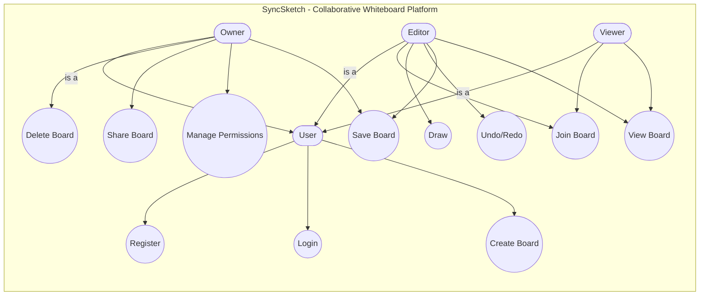

# Use Case Diagram – SyncSketch

## Overview
The Use Case Diagram for SyncSketch illustrates the high-level functional requirements of the system and maps out how different categories of users interact with the platform. It strictly divides system interactions based on structural Role-Based Access Control (RBAC), mapping precise permissions to appropriate user profiles.

## Use Case Diagram

## Actors Description

| Actor | Type | Description |
|---|---|---|
| **User** | Base | The foundational actor representing any authenticated individual on the platform. Capable of engaging with global system endpoints (Auth and Board Instantiation). |
| **Owner** | Inherited | Transcends standard privileges representing the structural creator of a target whiteboard. Holds absolute administrative sovereignty. |
| **Editor** | Inherited | An invited peripheral participant holding specific modification rights. Bounded fully by constraints mapping their write-access towards manipulating canvas strokes. |
| **Viewer** | Inherited | A restricted participant authorized specifically for read-only tracking. Connects natively to socket spaces without any broadcasting ability. |

## Use Case Descriptions

| Use Case | Associated Actor(s) | Description |
|---|---|---|
| **Register** | User | Issue cryptographic credentials yielding an authenticated profile on the core application. |
| **Login** | User | Authorize identity ensuring retrieval of stateless JWT configurations for ongoing communication multiplexing. |
| **Create Board** | User | Instantiate a blank spatial directory mapped towards WebSocket bindings. Grants instant "Owner" privileges to requester. |
| **Delete Board** | Owner | Exterminate all BSON events traversing related namespaces ensuring complete obliteration of targeted history. |
| **Share Board** | Owner | Generate valid secure tokens inviting adjacent Users towards overlapping spaces securely. |
| **Manage Perms** | Owner | Overload inherited bounds upgrading User constraints (Viewer -> Editor) guaranteeing precise canvas oversight. |
| **Save Board** | Owner, Editor | Explicitly execute robust BSON snapshots guaranteeing complex continuous stroke shapes persist flawlessly. |
| **Join Board** | Editor, Viewer | Upgrade underlying HTTP protocols entering a localized WebSocket Namespace/Room. |
| **Draw** | Editor | Continuously transmit vectorized coordinate payload structures mutating concurrent visual representations. |
| **Undo/Redo** | Editor | Systematically rollback specific Event Commands within chronological bounds tracking prior states. |
| **View Board** | Editor, Viewer | Asynchronously consume spatial multiplex payloads enabling continuous, sub-millisecond front-end canvas representations. |

## Role-Based Access Explanation
The system enforces strict RBAC to ensure data integrity and security within collaborative sessions. While all roles inherit fundamental identifying characteristics from the base `User`, their bounded contexts differ significantly. The `Owner` exercises total control over the board's lifecycle and membership matrix. The `Editor` operates with write constraints, restricted solely to manipulating drawing objects. The `Viewer` is entirely passive, functioning essentially as a real-time HTTP/WebSocket listener without broadcast privileges.

## System Boundary Explanation
The system boundary defines the core collaborative platform, encapsulating all functionalities related to board management, real-time drawing synchronization, and security assertions. External systems (like third-party OAuth providers or external databases) reside outside this boundary. The actors exist externally and interact with the system via defined interface boundaries (REST endpoints and WebSocket events).
